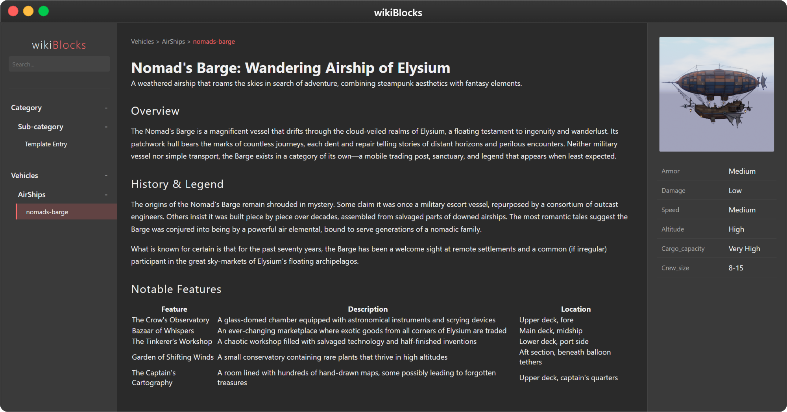

# wikiBlocks

wikiBlocks is a simple free and open source, file-based wiki that allows you to create your own personal knowledge base using markdown files. It's designed to be easy to set up, edit, and customize.

>developed by Bukkbeek | 2025 using Gemini 2.0 flash & Cline 

>visit  https://bukkbeek.github.io/

Included Example: 



## Features

*   **Markdown Support:** Write your wiki pages in Markdown for easy formatting and readability.
*   **Simple File Structure:**  Organize your wiki pages as markdown files within the `wiki/` directory. Categories and sub-categories can be created using subdirectories.
*   **Automatic Indexing:**  The `generate-index.js` script automatically creates `wiki-index.json`, which indexes all markdown files in your `wiki/` directory for easy navigation.
*   **Easy to Run:** Use `wiki-launcher.py` to start a local web server and view your wiki in a browser.
*   **Customizable Appearance:** Modify `styles.css` to personalize the look and feel of your wiki.

## How it Works

1.  **Markdown Files as Pages:** Each markdown file (`.md`) in the `wiki/` directory represents a page in your wiki. The file path determines the page's location in the wiki structure. For example, `wiki/Category/Sub-category/MyPage.md` will be accessible under the "Category" and "Sub-category" sections.
2.  **Automatic Index Generation:** When you run `wiki-launcher.py`, it first executes `generate-index.js`. This script scans the `wiki/` directory and generates a `wiki-index.json` file. This file contains a list of all your markdown files and their paths, which is used by `index.html` to create the wiki's navigation and search functionality. **You do not need to manually edit `wiki-index.json`**.
3.  **Running the Wiki:**  `wiki-launcher.py` starts a simple HTTP server using Python and opens your default web browser to display `index.html`. This page reads `wiki-index.json` to dynamically generate the wiki structure and display the content of your markdown pages when you click on links.

## Getting Started

1.  **Clone this repository:** Download or clone the wikiBlocks repository to your local machine.
2.  **Organize your wiki pages:**
    *   Navigate to the `wiki/` directory.
    *   Create subdirectories to represent categories and sub-categories in your wiki.
    *   Place your markdown files (`.md`) within these directories. For example, create `wiki/MyCategory/MyPage.md`.
3.  **Run `wiki-launcher.py`:**
note that you need to be Python installed to use this. or you can customize to use your own local server.
    *   Open a terminal in the root directory of the wikiBlocks repository.
    *   Execute the command: `python wiki-launcher.py`
    *   This will:
        *   Run `generate-index.js` to update `wiki-index.json`.
        *   Start a local web server.
        *   Open your web browser to `http://localhost:8000/index.html`, where you can view your wiki.
4.  **Edit Markdown Files:** To add or modify content, simply edit the markdown files in the `wiki/` directory using any text editor.  After saving changes, refresh your browser to see the updated wiki content.  You do not need to re-run `wiki-launcher.py` unless you add or remove markdown files, in which case re-running it will regenerate the `wiki-index.json`.

## Example Wiki Entry - Weapon Unit

Let's say you want to create a page for a "Sword of Fire" weapon unit in your wiki.

1.  **Create a Markdown File:** Navigate to the `wiki/` directory and create a new file named `SwordOfFire.md` (or within a category like `wiki/Weapons/Swords/SwordOfFire.md`).

2.  **Add Content with YAML Frontmatter:** Open `SwordOfFire.md` and add the following markdown content, including the YAML frontmatter at the top:

```markdown
---
id: sword-of-fire
category: Weapons
subcategory: Swords
title: Sword of Fire
image: sword-of-fire.png

stats:
  Damage: 45-55 Fire Damage
  Weight: 10 lbs
  Durability: 200
---

# Sword of Fire

A legendary sword imbued with fire magic.

## Description

The Sword of Fire is known for its fiery blade that can ignite enemies upon impact. It's a powerful weapon favored by fire mages and warriors alike.

## Lore

Forged in the heart of a volcano, this sword retains the intense heat of its creation. Legends say it was wielded by ancient fire deities.


```

   * You can create an `images/` subdirectory in the same directory as your markdown file and place images there. For example, `wiki/Weapons/Swords/images/sword-of-fire.png`.


3.  **View in Wiki:** Run `wiki-launcher.py` and navigate to your "Sword of Fire" page in the wiki. You should see the formatted content, stats, description, and lore, including the image if you added one.


This example demonstrates the use of YAML frontmatter to define metadata for your wiki pages, following the structure of the `template-entry.md` file. This approach ensures consistent formatting and organization across all wiki entries.


Here’s a breakdown of the template structure applied to the "Sword of Fire" example:


1.  **Create a Markdown File:** Navigate to the `wiki/` directory and create `SwordOfFire.md` (e.g., in `wiki/Weapons/Swords/SwordOfFire.md`).


2.  **Add Content with YAML Frontmatter:** Open `SwordOfFire.md` and include the YAML frontmatter at the beginning, followed by the markdown body as in the template markdown entry.

   * **YAML Frontmatter:**  Delimited by `---` at the start and end, this section defines metadata:
        *   `id`: Unique identifier ("sword-of-fire").
        *   `category`: Main category ("Weapons").
        *   `subcategory`: Subcategory ("Swords").
        *   `title`: Page title ("Sword of Fire").
        *   `image`: Image filename ("sword-of-fire.png").
        *   `stats`:  Statistics as key-value pairs.
   * **Markdown Body:** Below the frontmatter, the content uses Markdown for formatting.


3.  **View in Wiki:** Run `wiki-launcher.py`; access "Sword of Fire" page. The wiki uses YAML for categorization and display, rendering markdown body content.


Using this template ensures organized, consistent wiki entries, enhancing navigation and usability.


## Customization

*   **Appearance:** Edit `styles.css` to change the CSS styles and customize the visual appearance of your wiki.
*   **Functionality:** Modify `app.js` and `index.html` to add or change the JavaScript functionality and HTML structure of the wiki for advanced users who want to extend or modify the wiki's behavior.

## License

This project is licensed under the [MIT License](LICENSE). Feel free to use, modify, and distribute it as you wish.
